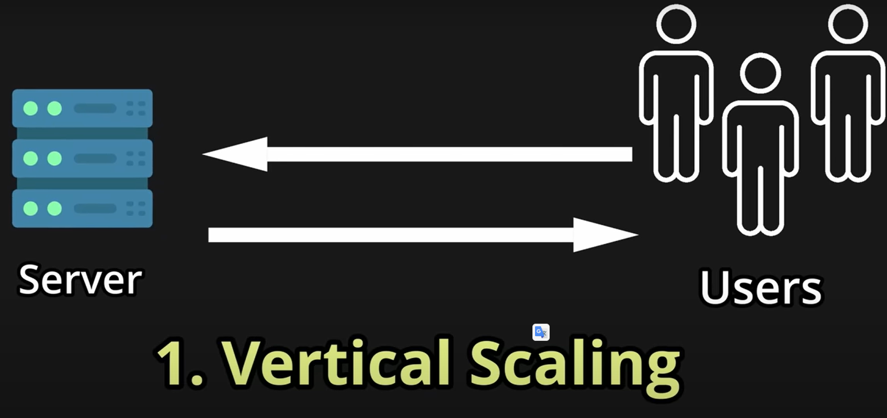
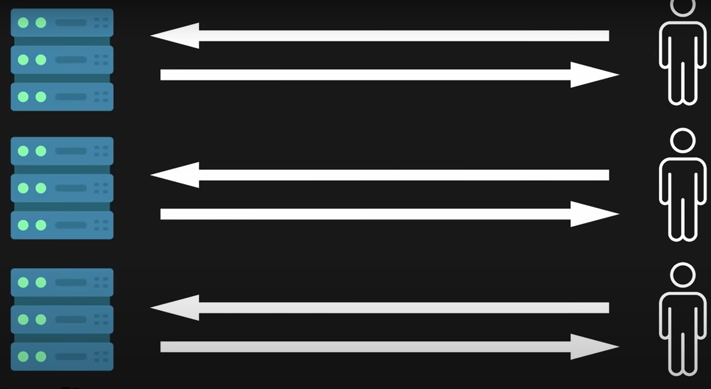
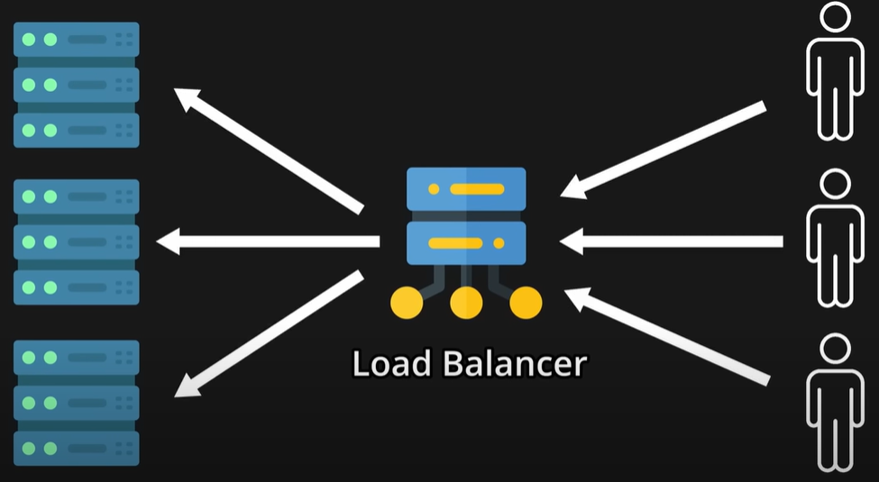
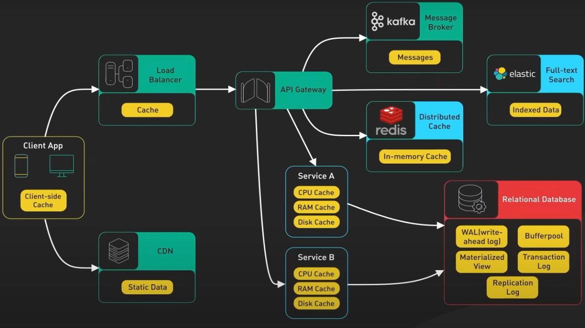
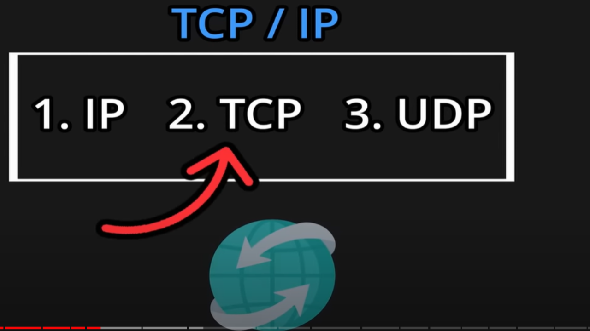
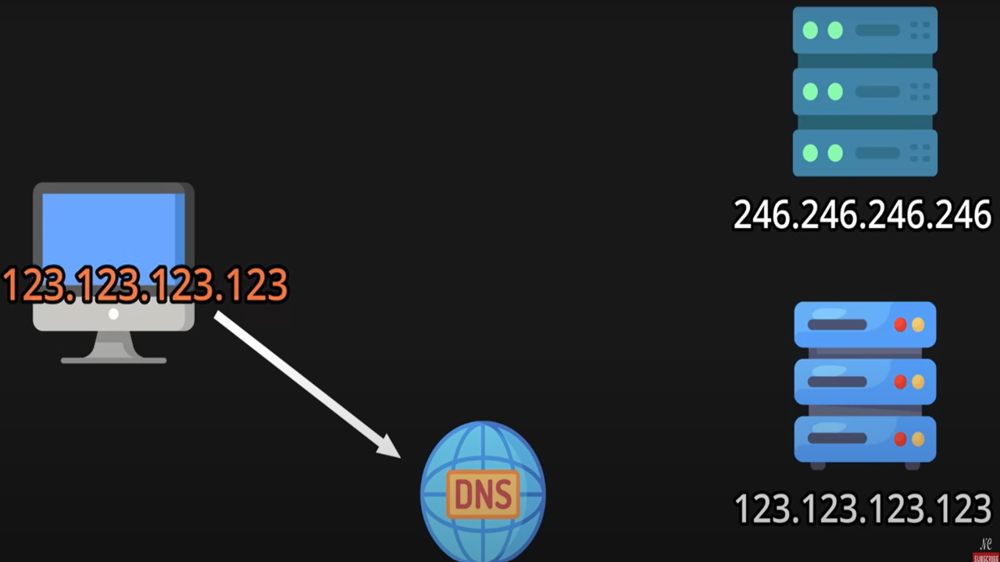
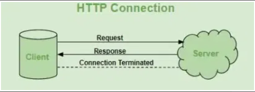
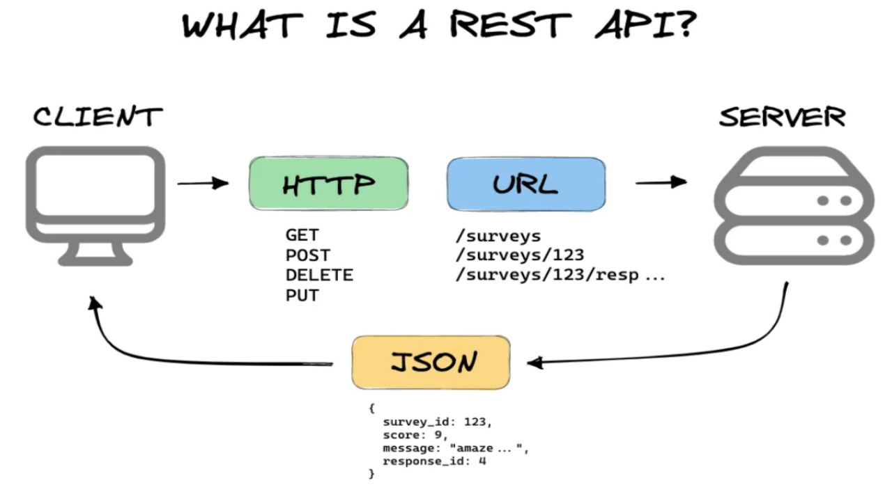

# 20  System Design Concepts

## 1. Vertical Scaling
Vertical scaling, also known as "scaling up," involves adding more resources to a single server or machine to handle increased load or performance demands.

**Drawbacks of Vertical Scaling:**

- Finite Limits: There is a limit to how much a single server can be upgraded.
Cost: High-end hardware upgrades can be expensive.
- Risk of Downtime: Potential downtime during hardware upgrades or maintenance
- Single Point of Failure: If the upgraded server fails, the entire application can go down.

## 2. Horizontal Scaling
Horizontal scaling, also known as "scaling out," involves adding more servers or machines to a system to handle increased load or performance demands.

**Key Characteristics of Horizontal Scaling:**

- Resource Addition: Adding more servers or nodes to the system.
- Distributed Load: Spreads the load across multiple machines, enhancing overall system capacity.
- Scalability: Potentially limitless scalability as more machines can be added as needed.
- Fault Tolerance: Increased redundancy and fault tolerance, as the failure of one node doesn't bring down the entire system.
- Complexity: Requires sophisticated load balancing, data distribution, and often a more complex infrastructure to manage multiple nodes.
- Consistency Challenges: May involve challenges related to data consistency, especially in distributed databases or applications.

## 3. Load Balancer or Reverse Proxy
A load balancer is a device, server or software application that distributes incoming network or application traffic across multiple servers. Load balancers play a crucial role in horizontal scaling by enabling efficient resource utilization and enhancing fault tolerance.

**Key Functions of a Load Balancer:**

- Traffic Distribution: Distributes incoming requests evenly across multiple servers to prevent any single server from becoming a bottleneck.

- Health Monitoring: Continuously checks the health and status of servers to ensure that only healthy servers receive traffic.

- Failover: Automatically reroutes traffic to healthy servers in the event of a server failure, enhancing system reliability.

- SSL Termination: Offloads SSL decryption from backend servers, improving their performance by reducing computational load.

- Session Persistence: Ensures that a user's session is consistently directed to the same server, which is important for applications requiring session-specific data.

- Traffic Optimization: Can optimize traffic by compressing data, caching responses, or distributing workloads based on server capacity.

**Load Balancing Algorithms:**
- Round Robin: Distributes requests sequentially across all servers.
- Least Connections: Directs traffic to the server with the fewest active connections.
- Least Response Time: Sends requests to the server with the lowest response time.
IP Hash: Routes requests based on the client's IP address, ensuring consistent routing for the same client.
- Weighted Round Robin/Least Connections: Assigns weights to servers based on their capacity, with more powerful servers receiving more traffic.

## 4. Content Delivery Networks(CDN)
A Content Delivery Network (CDN) is a system of distributed servers that deliver web content and other web resources to users based on their geographic location, the origin of the web page, and the content delivery server. The primary goal of a CDN is to improve the performance, speed, and availability of web services by reducing the physical distance between the server and the user.

**How CDNs Work:**

- Geographical Distribution: CDNs distribute copies of web content to strategically located servers around the world.

- Caching: Static content like images, videos, CSS, and JavaScript files are cached on these distributed servers.

- *Request Routing: When a user requests content from a website, the request is routed to the nearest CDN server rather than the origin server.*

**Why CDNs are Used:**

- Reduced Latency: By serving content from a server close to the user, CDNs reduce the time it takes for data to travel, improving load times.

- Increased Availability and Redundancy: Distributed servers ensure that content is always available, even if one server goes down.

- Scalability: CDNs can handle high traffic volumes and scale dynamically to meet demand without impacting the performance of the origin server.

**Examples of CDN Use Cases:**

- E-commerce Websites: Retailers like Amazon and eBay use CDNs to ensure fast page load times and handle large amounts of traffic during peak shopping periods.

- Streaming Services: Netflix and YouTube use CDNs to deliver high-quality video content to users around the world without buffering.

- News Websites: News outlets like BBC and CNN use CDNs to quickly deliver breaking news and multimedia content.

- Gaming: Online gaming platforms like Steam use CDNs to distribute game updates and patches efficiently to players globally.

## 5. Caching

Caching is a technique used in system design to store copies of frequently accessed data in a temporary storage location, called a cache, so that future requests for that data can be served more quickly. 

**Algorithms:**

- *Least Recently Used (LRU):*

Description: Evicts the least recently accessed items first.

Use Case: Effective when recent data is more likely to be accessed again.

- *Least Frequently Used (LFU):*

Description: Evicts items that are accessed least frequently.

Use Case: Useful when frequently accessed data is more important than recent data.

- *First In, First Out (FIFO):*

Description: Evicts the oldest items first.

Use Case: Simple implementation, but not necessarily optimal for most caching scenarios.

- *Time-to-Live(TTL):*

Description: Items are evicted after a certain period.

Use Case: Ensures data freshness by periodically removing old data.

- *Random Replacement:*

Description: Randomly selects items to evict.

Use Case: Useful in scenarios where no clear access pattern is available.

Examples of CDN Use Cases:

    1. E-commerce Websites:

    Use Case: E-commerce platforms like Amazon and eBay use CDNs to cache product images, descriptions, and user reviews to ensure fast page load times and a smooth shopping experience.

    2. Media Streaming:

    Use Case: Streaming services like Netflix and YouTube use CDNs to cache video content at edge servers, allowing users to stream videos with minimal buffering and latency.

    3. News Websites:

    Use Case: News outlets like BBC and CNN use CDNs to distribute and cache articles, images, and videos, ensuring that content is delivered quickly to a global audience, especially during high-traffic events.

    4. Online Gaming:

    Use Case: Gaming platforms like Steam use CDNs to distribute game updates, patches, and downloadable content, ensuring that gamers receive updates quickly and reliably.

    5. Software Distribution:

    Use Case: Companies like Microsoft and Apple use CDNs to deliver software updates and applications to users around the world efficiently.

## 6. IP Address
An IP address (Internet Protocol address) is a unique identifier assigned to each device connected to a network that uses the Internet Protocol for communication.

## 7. TCP/IP

TCP/IP (Transmission Control Protocol/Internet Protocol) is a suite of communication protocols used to interconnect network devices on the internet. It provides end-to-end data communication, specifying how data should be packetized, addressed, transmitted, routed, and received.

**The TCP/IP model has four layers, each responsible for specific functions:**

- Application Layer
- Transport Layer
- Internet Layer
- Network Interface Layer

### HTTP and WebSockets are build over TCP.

## 8. DNS

The Domain Name System (DNS) is a hierarchical and decentralized naming system for devices, services, and other resources connected to the internet or a private network. It translates human-friendly domain names (like www.example.com) into IP addresses (like 192.0.2.1) that computers use to identify each other on the network.

## 9. HTTP Hypertext Transfer Protocol:

HTTP (Hypertext Transfer Protocol) is the foundational protocol used for transmitting data on the World Wide Web. It defines how messages are formatted and transmitted, and how web servers and browsers should respond to various commands. **HTTP is an application-layer protocol that operates on top of other protocols in the TCP/IP suite.**

### Key Features of HTTP

***Stateless: Each HTTP request from a client to server is independent, meaning the server retains no memory of previous requests. This simplifies server design but requires state management for more complex interactions.***

Request-Response Model: Communication between client and server is initiated by an HTTP request (from the client) and followed by an HTTP response (from the server).

Example Use Case: 

1. Web Browsing:
Use Case: HTTP is the primary protocol used for loading web pages in web browsers. When you enter a URL in your browser's address bar and press Enter, your browser sends an HTTP request to the server hosting the website, which responds with the requested web page content (HTML, CSS, JavaScript, images, etc.) using HTTP responses.

2. RESTful APIs:
Use Case: HTTP is commonly used as the protocol for building RESTful (Representational State Transfer) APIs. APIs built using HTTP adhere to the principles of REST, making them simple, scalable, and interoperable. Clients can make HTTP requests to interact with RESTful APIs, typically using methods like GET, POST, PUT, DELETE, etc., to perform CRUD (Create, Read, Update, Delete) operations on resources.

3. Web Services:
Use Case: HTTP is used for communication between various web services and clients. For example, when a client application needs to interact with a server-side service to fetch data, it can make HTTP requests to the server, which responds with the requested data using HTTP responses. SOAP (Simple Object Access Protocol) and XML-RPC are examples of protocols built on top of HTTP for web service communication.

## 10. REST APIs

REST: Representational State Transfer Application Programming
API: Application Programming Interface

A REST API (Representational State Transfer Application Programming Interface) is an architectural style for designing networked applications. It is based on the principles of REST

[Ref: What Is REST API?](https://www.youtube.com/watch?v=-mN3VyJuCjM)

**Key Principles of REST**

- Resource-Based: Resources are the key abstraction in RESTful APIs, and each resource is uniquely identified by a URI (Uniform Resource Identifier). Resources can represent entities like users, products, or any other domain-specific objects.

- Uniform Interface: REST APIs have a uniform and predictable interface, consisting of standard HTTP methods (GET, POST, PUT, DELETE) for performing CRUD (Create, Read, Update, Delete) operations on resources. Each method has a specific meaning:

- GET: Retrieve a representation of the resource.
- POST: Create a new resource.
- PUT: Update an existing resource or create a new one if it does not exist.
- DELETE: Delete the resource.
- ### Stateless: REST APIs are stateless, meaning each request from a client to the server must contain all the information necessary to understand and process the request. The server does not store any client state between requests.

- Client-Server Architecture: REST APIs follow a client-server architecture, where clients and servers are separate entities that communicate over a stateless protocol (typically HTTP). This separation allows for scalability and modifiability.

- Layered System: REST APIs can be layered, with intermediaries like proxies, gateways, and caching servers between clients and servers. Each layer hides the complexity of the underlying system, improving scalability and flexibility.

## 11. Graph QL 

Unlike traditional REST APIs, where clients have limited control over the shape and size of the data they receive, GraphQL allows clients to request only the data or exactly the data they need, in the format they need it, with a single query.

**Key Features of GraphQL** 

- Declarative Data Fetching: Clients can specify exactly what data they need, avoiding over-fetching or under-fetching of data.

### Use Cases and Examples of GraphQL

    1. APIs for Single-Page Applications (SPAs):

        Use Case: GraphQL is well-suited for SPAs, where clients often need to fetch complex data structures from the server to render dynamic user interfaces.

        Example: A social media platform uses GraphQL to fetch user profiles, posts, comments, and related data in a single query, optimizing performance and reducing network overhead.
    
    2. Mobile Applications:
    
    Use Case: GraphQL is ideal for mobile applications, where minimizing the amount of data transferred over the network is critical for performance and battery life.
    
    Example: A travel booking app uses GraphQL to fetch flight availability, pricing, and booking details, allowing users to search for flights and make reservations efficiently.