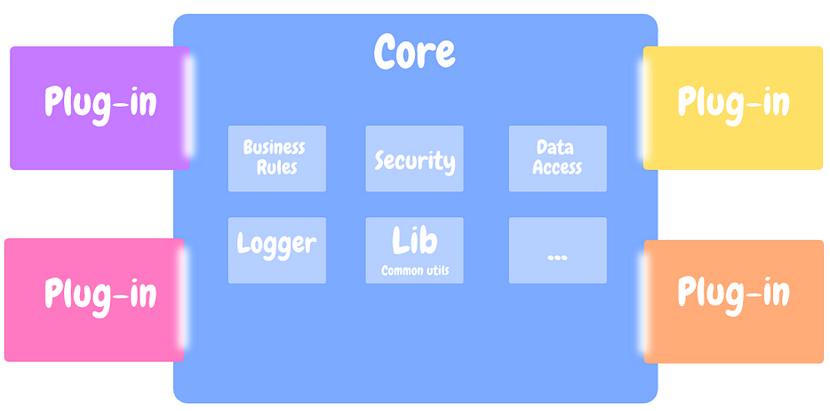

# Top Five Architecture Patterns

## 1. Layered (N-Tier) Architecture:

Layered (or N-Tier) architecture is a design pattern used in software development to organize an application into logically separated layers, each with distinct responsibilities and roles.

### Common Layers:

### Presentation Layer (UI Layer): 

Responsible for displaying information to the user and interpreting user commands. Examples: Web pages, mobile app interfaces, desktop GUIs.

### Business Logic Layer (Application Layer):

Contains the core functionality and business rules of the application. Processes user inputs and makes logical decisions.

### Service Layer:

Acts as an intermediary between the business logic and data access layers. Often handles transaction management, caching, and other infrastructure concerns.

### Data Access Layer (Persistence Layer):

Responsible for data storage and retrieval.
Interacts with databases, file systems, and other persistence mechanisms.

### Database Layer (sometimes considered part of the Data Access Layer):
The actual database system where data is stored.

### When It Is Used:
- A clear separation of concerns is needed.

- There is a need to structure complex applications for maintainability and scalability.

- Different teams are responsible for different parts of the application.

- There is a requirement for reusability of layers across different projects or applications.

### Real-World Examples:

    E-commerce Platforms:

    Amazon: Uses a layered architecture to manage user interfaces (web and mobile apps), business logic (ordering, payments, recommendations), and data access (inventory databases, user profiles).

    Content Management Systems (CMS):
    
    WordPress: While primarily plugin-based, WordPress core development follows a layered approach for theme rendering (presentation), plugin integration (business logic), and database interactions (data access).

### Pros and Cons:

#### Pros:

- Separation of Concerns: Each layer focuses on a specific aspect of the application.

- Maintainability: Easier to update and modify individual layers.

- Scalability: Different layers can be scaled independently.

- Reusability: Layers can be reused across different projects.

#### Cons:

- Performance Overhead: Layered interactions can introduce latency.

- Monolithic Tendencies: Can lead to large, tightly coupled applications if not managed properly.

- Complexity in Data Flow: Data passing through multiple layers can become complex and hard to manage

## 2. Event Driven Architecture

Event-Driven Architecture (EDA) is a design paradigm in which the flow of the program is determined by events—changes in state, user inputs, or messages from other programs or systems.

### Key Components:

- Event Producers: Entities that generate events. These could be user actions, sensor outputs, or changes in data.

- Event Consumers: Entities that respond to events. They can perform actions based on the events they receive.

- Event Channel: The medium through which events are transmitted from producers to consumers. This could be a message queue, a streaming platform, or a broker.

- Event Processor: Processes the event, which could involve updating a database, triggering other events, or invoking services.

### When It Is Used:

- The system requires real-time processing and responses.
Components need to be highly decoupled and independently scalable.

- There is a need to handle high volumes of events or data streams.

- Asynchronous processing is beneficial to improve responsiveness and performance.

### Real-World Examples:
    Twitter: Uses EDA to handle tweets, retweets, likes, and follows. Events like new tweets or user interactions trigger notifications, updates to feeds, and analytics processing.

    Amazon: Implements EDA to manage various aspects like inventory updates, order processing, shipping notifications, and recommendation engines. Events such as item purchases trigger updates across different services asynchronously.
    Financial Services:

    PayPal: Utilizes EDA to process transactions, detect fraud, and manage notifications. Events like transaction initiations and completions are processed in real-time to ensure timely responses and updates.
    
    IoT Platforms(Nest): The smart thermostat system processes events from sensors and user inputs to adjust temperature settings, send alerts, and perform energy-saving actions.
    Streaming Services:

    Netflix: Uses EDA to manage content delivery, user activity monitoring, and personalized recommendations. Events like video playback, pause, and resume are used to adjust streaming quality and suggest new content.

### Pros and Cons:
#### Pros:
- Scalability: Components can scale independently, and the system can handle high volumes of events.

- Decoupling: Producers and consumers are loosely coupled, allowing independent development and deployment.

- Real-time Processing: Immediate responses to events improve user experience and system responsiveness.

#### Cons:

- Complexity: Managing and debugging an event-driven system can be complex due to the asynchronous nature of events.

- Eventual Consistency: Ensuring data consistency across distributed components may be challenging.

## 3. Microkernel Architecture(Plugin Architecture)

A design pattern that separates the core system functions from the extended functionalities. The core system (the microkernel) provides the minimal required functionality, while additional features are implemented as separate plugins or modules that interact with the core.

### Key Components:

- Microkernel: The core part of the system that provides essential services and abstractions, such as basic I/O operations, memory management, and low-level process management.

- Plugins/Modules: Additional functionalities that extend the core capabilities. These can be added, updated, or removed independently without affecting the core system.

- Communication Mechanism: A way for the core system and the plugins to interact. This can be through APIs, messaging, or other inter-process communication methods.

### When It Is Used:

Microkernel architecture is used when:

- The system needs to be highly extensible and customizable. There is a requirement for high availability and minimal downtime, allowing features to be added or modified without restarting the system.

- The system needs to be modular to support different configurations or environments.

- There is a need to isolate the core functionalities from optional features to enhance security and stability.

#### Real-World Examples:

    Operating Systems: Uses a microkernel architecture where the core system manages basic tasks, and additional functionalities like file systems, network protocols, and device drivers are implemented as modules.

    Microsoft Office: Certain components of Microsoft Office, like the core word processing functionalities, are part of the microkernel, while additional features like grammar checkers, add-ins, and templates are implemented as plugins.

    Apache HTTP Server: Uses a microkernel architecture where the core server handles basic HTTP requests, and additional capabilities like SSL, URL rewriting, and authentication are provided by modules that can be dynamically loaded or unloaded.

#### Pros and Cons:
#### Pros:

- Modularity: Easily extendable and customizable, allowing new features to be added without modifying the core system.

- Flexibility: Different configurations can be created by enabling or disabling specific plugins

- Stability and Security: Isolating the core system from additional features enhances stability and security.

#### Cons:

- Complexity: The communication between the core and plugins can add complexity.

- Performance Overhead: Inter-process communication and the modular approach may introduce performance overhead.

## 4. Microservices

Microservices architecture structures an application as a collection of loosely coupled, independently deployable services. **Each microservice corresponds to a specific business capability and can be developed, deployed, and scaled independently.**

### Characteristics:

- Independent Deployment: Each service can be deployed independently.
- Loose Coupling: Services interact through well-defined APIs and are not tightly integrated.
- Scalability: Services can be scaled independently based on demand.
- Resilience: Failure in one service does not necessarily bring down the entire system.
- Technology Diversity: Different services can use different technologies and programming languages.

### When It Is Used:

- The application needs to be highly scalable and resilient.
- There is a need for continuous deployment and integration.
- ***The system is complex and can be divided into distinct business capabilities.***
- ***Different parts of the system require different technologies or need to be developed by different teams.***

### Real-World Examples:

    Netflix:
    Use Case: Netflix transitioned to a microservices architecture to manage its large and complex system. Each microservice handles different aspects such as user interface, recommendations, streaming, billing, and customer support.

    Uber:
    Use Case: Uber's platform consists of numerous microservices, each handling different functionalities such as ride matching, fare calculation, driver management, and payment processing.

[Ref: What Are Microservices Really All About? (And When Not To Use It)](https://www.youtube.com/watch?v=lTAcCNbJ7KE)

### Pros and Cons:
#### Pros:

- Scalability: Services can be scaled independently to handle varying loads.

- Flexibility: Different teams can work on different services using the best-suited technologies.
- Resilience: Failures in one service do not affect the entire system.
- Speed of Development: Independent deployment and continuous delivery accelerate development cycles.
- Maintainability: Smaller, focused services are easier to maintain and understand.

#### Cons:

- Complexity: Managing many services can be complex, particularly in terms of deployment, monitoring, and inter-service communication.

- Data Consistency: Ensuring data consistency across services can be challenging.

- Latency: **Network communication between services can introduce latency.**

## 5. Monolithic Architecture

Monolithic architecture is a traditional model for designing software applications. In this architecture, the entire application is developed and deployed as a single, unified unit. ***All components, such as user interface, business logic, and data access, are integrated into one codebase and run as a single process.***

## References

1. [Ref: Top 5 Most Used Architecture Patterns](https://www.youtube.com/watch?v=f6zXyq4VPP8)

2. [Ref: What Are Microservices Really All About? (And When Not To Use It)](https://www.youtube.com/watch?v=lTAcCNbJ7KE)

