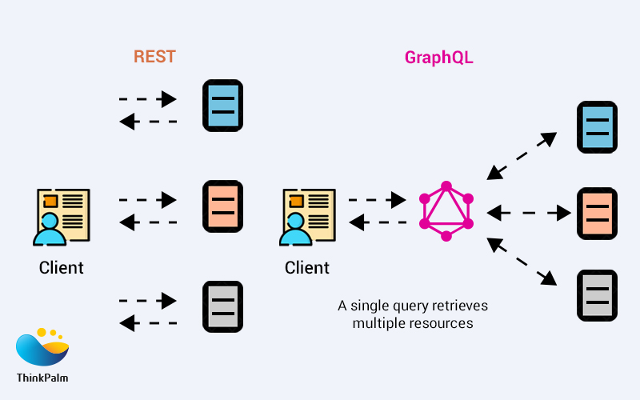

# 20  System Design Concepts

## 1. Vertical Scaling
Vertical scaling, also known as "scaling up," involves adding more resources to a single server or machine to handle increased load or performance demands.

**Drawbacks of Vertical Scaling:**

- Finite Limits: There is a limit to how much a single server can be upgraded.
Cost: High-end hardware upgrades can be expensive.
- Risk of Downtime: Potential downtime during hardware upgrades or maintenance
- Single Point of Failure: If the upgraded server fails, the entire application can go down.

## 2. Horizontal Scaling
Horizontal scaling, also known as "scaling out," involves adding more servers or machines to a system to handle increased load or performance demands.

**Key Characteristics of Horizontal Scaling:**

- Resource Addition: Adding more servers or nodes to the system.
- Distributed Load: Spreads the load across multiple machines, enhancing overall system capacity.
- Scalability: Potentially limitless scalability as more machines can be added as needed.
- Fault Tolerance: Increased redundancy and fault tolerance, as the failure of one node doesn't bring down the entire system.
- Complexity: Requires sophisticated load balancing, data distribution, and often a more complex infrastructure to manage multiple nodes.
- Consistency Challenges: May involve challenges related to data consistency, especially in distributed databases or applications.

## 3. Load Balancer or Reverse Proxy
A load balancer is a device, server or software application that distributes incoming network or application traffic across multiple servers. Load balancers play a crucial role in horizontal scaling by enabling efficient resource utilization and enhancing fault tolerance.

**Key Functions of a Load Balancer:**

- Traffic Distribution: Distributes incoming requests evenly across multiple servers to prevent any single server from becoming a bottleneck.

- Health Monitoring: Continuously checks the health and status of servers to ensure that only healthy servers receive traffic.

- Failover: Automatically reroutes traffic to healthy servers in the event of a server failure, enhancing system reliability.

- SSL Termination: Offloads SSL decryption from backend servers, improving their performance by reducing computational load.

- Session Persistence: Ensures that a user's session is consistently directed to the same server, which is important for applications requiring session-specific data.

- Traffic Optimization: Can optimize traffic by compressing data, caching responses, or distributing workloads based on server capacity.

**Load Balancing Algorithms:**
- Round Robin: Distributes requests sequentially across all servers.
- Least Connections: Directs traffic to the server with the fewest active connections.
- Least Response Time: Sends requests to the server with the lowest response time.
IP Hash: Routes requests based on the client's IP address, ensuring consistent routing for the same client.
- Weighted Round Robin/Least Connections: Assigns weights to servers based on their capacity, with more powerful servers receiving more traffic.

## 4. Content Delivery Networks(CDN)
A Content Delivery Network (CDN) is a system of distributed servers that deliver web content and other web resources to users based on their geographic location, the origin of the web page, and the content delivery server. The primary goal of a CDN is to improve the performance, speed, and availability of web services by reducing the physical distance between the server and the user.

**How CDNs Work:**

- Geographical Distribution: CDNs distribute copies of web content to strategically located servers around the world.

- Caching: Static content like images, videos, CSS, and JavaScript files are cached on these distributed servers.

- *Request Routing: When a user requests content from a website, the request is routed to the nearest CDN server rather than the origin server.*

**Why CDNs are Used:**

- Reduced Latency: By serving content from a server close to the user, CDNs reduce the time it takes for data to travel, improving load times.

- Increased Availability and Redundancy: Distributed servers ensure that content is always available, even if one server goes down.

- Scalability: CDNs can handle high traffic volumes and scale dynamically to meet demand without impacting the performance of the origin server.

**Examples of CDN Use Cases:**

    E-commerce Websites: Retailers like Amazon and eBay use CDNs to ensure fast page load times and handle large amounts of traffic during peak shopping periods.

    Streaming Services: Netflix and YouTube use CDNs to deliver high-quality video content to users around the world without buffering.

    News Websites: News outlets like BBC and CNN use CDNs to quickly deliver breaking news and multimedia content.

    Gaming: Online gaming platforms like Steam use CDNs to distribute game updates and patches efficiently to players globally.

## 5. Caching

Caching is a technique used in system design to store copies of frequently accessed data in a temporary storage location, called a cache, so that future requests for that data can be served more quickly. 

**Algorithms:**

- *Least Recently Used (LRU):*

Description: Evicts the least recently accessed items first.

Use Case: Effective when recent data is more likely to be accessed again.

- *Least Frequently Used (LFU):*

Description: Evicts items that are accessed least frequently.

Use Case: Useful when frequently accessed data is more important than recent data.

- *First In, First Out (FIFO):*

Description: Evicts the oldest items first.

Use Case: Simple implementation, but not necessarily optimal for most caching scenarios.

- *Time-to-Live(TTL):*

Description: Items are evicted after a certain period.

Use Case: Ensures data freshness by periodically removing old data.

- *Random Replacement:*

Description: Randomly selects items to evict.

Use Case: Useful in scenarios where no clear access pattern is available.

Examples of CDN Use Cases:

    1. E-commerce Websites:

    Use Case: E-commerce platforms like Amazon and eBay use CDNs to cache product images, descriptions, and user reviews to ensure fast page load times and a smooth shopping experience.

    2. Media Streaming:

    Use Case: Streaming services like Netflix and YouTube use CDNs to cache video content at edge servers, allowing users to stream videos with minimal buffering and latency.

    3. News Websites:

    Use Case: News outlets like BBC and CNN use CDNs to distribute and cache articles, images, and videos, ensuring that content is delivered quickly to a global audience, especially during high-traffic events.

    4. Online Gaming:

    Use Case: Gaming platforms like Steam use CDNs to distribute game updates, patches, and downloadable content, ensuring that gamers receive updates quickly and reliably.

    5. Software Distribution:

    Use Case: Companies like Microsoft and Apple use CDNs to deliver software updates and applications to users around the world efficiently.

## 6. IP Address
An IP address (Internet Protocol address) is a unique identifier assigned to each device connected to a network that uses the Internet Protocol for communication.

## 7. TCP/IP

TCP/IP (Transmission Control Protocol/Internet Protocol) is a suite of communication protocols used to interconnect network devices on the internet. It provides end-to-end data communication, specifying how data should be packetized, addressed, transmitted, routed, and received.

**The TCP/IP model has four layers, each responsible for specific functions:**

- Application Layer
- Transport Layer
- Internet Layer
- Network Interface Layer

### HTTP and WebSockets are build over TCP.

## 8. DNS

The Domain Name System (DNS) is a hierarchical and decentralized naming system for devices, services, and other resources connected to the internet or a private network. It translates human-friendly domain names (like www.example.com) into IP addresses (like 192.0.2.1) that computers use to identify each other on the network.

## 9. HTTP Hypertext Transfer Protocol:

HTTP (Hypertext Transfer Protocol) is the foundational protocol used for transmitting data on the World Wide Web. It defines how messages are formatted and transmitted, and how web servers and browsers should respond to various commands. **HTTP is an application-layer protocol that operates on top of other protocols in the TCP/IP suite.**

### Key Features of HTTP

***Stateless: Each HTTP request from a client to server is independent, meaning the server retains no memory of previous requests. This simplifies server design but requires state management for more complex interactions.***

Request-Response Model: Communication between client and server is initiated by an HTTP request (from the client) and followed by an HTTP response (from the server).

Example Use Case: 

1. Web Browsing:
Use Case: HTTP is the primary protocol used for loading web pages in web browsers. When you enter a URL in your browser's address bar and press Enter, your browser sends an HTTP request to the server hosting the website, which responds with the requested web page content (HTML, CSS, JavaScript, images, etc.) using HTTP responses.

2. RESTful APIs:
Use Case: HTTP is commonly used as the protocol for building RESTful (Representational State Transfer) APIs. APIs built using HTTP adhere to the principles of REST, making them simple, scalable, and interoperable. Clients can make HTTP requests to interact with RESTful APIs, typically using methods like GET, POST, PUT, DELETE, etc., to perform CRUD (Create, Read, Update, Delete) operations on resources.

3. Web Services:
Use Case: HTTP is used for communication between various web services and clients. For example, when a client application needs to interact with a server-side service to fetch data, it can make HTTP requests to the server, which responds with the requested data using HTTP responses. SOAP (Simple Object Access Protocol) and XML-RPC are examples of protocols built on top of HTTP for web service communication.

## 10. REST APIs

REST: Representational State Transfer Application Programming
API: Application Programming Interface

A REST API (Representational State Transfer Application Programming Interface) is an architectural style for designing networked applications. It is based on the principles of REST

[Ref: What Is REST API?](https://www.youtube.com/watch?v=-mN3VyJuCjM)

**Key Principles of REST**

- Resource-Based: Resources are the key abstraction in RESTful APIs, and each resource is uniquely identified by a URI (Uniform Resource Identifier). Resources can represent entities like users, products, or any other domain-specific objects.

- Uniform Interface: REST APIs have a uniform and predictable interface, consisting of standard HTTP methods (GET, POST, PUT, DELETE) for performing CRUD (Create, Read, Update, Delete) operations on resources. Each method has a specific meaning:

- GET: Retrieve a representation of the resource.
- POST: Create a new resource.
- PUT: Update an existing resource or create a new one if it does not exist.
- DELETE: Delete the resource.
- ### Stateless: REST APIs are stateless, meaning each request from a client to the server must contain all the information necessary to understand and process the request. The server does not store any client state between requests.

- Client-Server Architecture: REST APIs follow a client-server architecture, where clients and servers are separate entities that communicate over a stateless protocol (typically HTTP). This separation allows for scalability and modifiability.

- Layered System: REST APIs can be layered, with intermediaries like proxies, gateways, and caching servers between clients and servers. Each layer hides the complexity of the underlying system, improving scalability and flexibility.

## 11. Graph QL 

Unlike traditional REST APIs, where clients have limited control over the shape and size of the data they receive, GraphQL allows clients to request only the data or exactly the data they need, in the format they need it, with a single query.

[Ref: GraphQL vs REST API?](https://www.youtube.com/shorts/_7YhqaSzPkA)
[Ref: What Is GraphQL? REST vs. GraphQL](https://www.youtube.com/watch?v=yWzKJPw_VzM)
[Ref: GraphQL Explained in 100 Seconds](https://www.youtube.com/watch?v=eIQh02xuVw4)

**Key Features of GraphQL** 

- Declarative Data Fetching: Clients can specify exactly what data they need, avoiding over-fetching or under-fetching of data.

### Use Cases and Examples of GraphQL

    1. APIs for Single-Page Applications (SPAs):

        Use Case: GraphQL is well-suited for SPAs, where clients often need to fetch complex data structures from the server to render dynamic user interfaces.

        Example: A social media platform uses GraphQL to fetch user profiles, posts, comments, and related data in a single query, optimizing performance and reducing network overhead.
    
    2. Mobile Applications:
    
    Use Case: GraphQL is ideal for mobile applications, where minimizing the amount of data transferred over the network is critical for performance and battery life.
    
    Example: A travel booking app uses GraphQL to fetch flight availability, pricing, and booking details, allowing users to search for flights and make reservations efficiently.

## 12. gRPC

gRPC(gRPC Remote Procedure Call) is a high-performance, open-source framework developed by Google that enables remote procedure calls (RPC) across different systems. It leverages HTTP/2 for transport, Protocol Buffers (protobufs) for serialization, and offers features like bi-directional streaming, flow control, and low latency.

### Key Features of gRPC:
- Protocol Buffers (Protobufs): gRPC uses protobufs for defining the service interface and the structure of the payload messages, which makes serialization and deserialization more efficient than traditional JSON or XML formats.

- HTTP/2: gRPC uses HTTP/2 as its transport protocol, which brings several advantages such as multiplexing, flow control, header compression, and server push, resulting in improved performance.

- Streaming: gRPC supports various types of streaming:
    1. Unary RPC: Single request, single response.
    2. Server Streaming RPC: Single request, multiple responses.
    3. Client Streaming RPC: Multiple requests, single response.4. Bidirectional Streaming RPC: Multiple requests and responses flowing in both directions.

- Language Support: gRPC supports multiple programming languages including C++, Java, Python, Go, Ruby, C#, and more, making it versatile for different environments.

- Service Definition: Services and messages are defined in .proto files, which can then be used to generate client and server code in different languages

### When to Use gRPC:
- Low Latency Communication: When high performance and low latency are critical, such as in real-time applications.

- Complex APIs: When you need to define complex APIs with strong typing and want to ensure consistency across services.

- Microservices: Ideal for microservices architectures where different services need to communicate efficiently and reliably.

- Cross-Language Support: When there is a need for services written in different programming languages to interact seamlessly.

- Streaming Requirements: When applications require real-time streaming capabilities for data exchange.

### Use Cases and Examples:

    - Microservices Architecture:
        Use Case: In a microservices architecture, services need to communicate with each other efficiently.

        Example: A large-scale e-commerce platform where different services like user management, inventory, and payment processing need to interact seamlessly. gRPC provides the needed performance and reliability.
    
    - Real-Time Communication:

        Use Case: Applications that require real-time data updates and low-latency communication.

        Example: A chat application or online gaming platform where real-time interaction between clients and servers is essential. gRPC’s bi-directional streaming ensures smooth and real-time data flow.

    - Polyglot Environments:

        Use Case: Organizations with services written in multiple programming languages.

        Example: A tech company with services written in Java, Go, and Python. Using gRPC ensures that all these services can communicate efficiently without worrying about language-specific serialization/deserialization issues.
    
    - IoT Systems:
        
        Use Case: Internet of Things (IoT) systems where devices need to send and receive data from servers reliably.

        Example: A home automation system where various sensors and devices need to communicate with a central server. gRPC’s efficient binary protocol ensures minimal bandwidth usage and faster communication.

    - Edge Computing:

    Use Case: Edge computing scenarios where data processing happens closer to the data source.

    Example: A content delivery network (CDN) that processes data at the edge nodes. gRPC can be used for efficient communication between edge nodes and central servers, ensuring quick data processing and reduced latency.

## 13. WebSockets

WebSocket is a communication protocol that provides full-duplex, bidirectional communication channels over a single, long-lived TCP connection. This means that both the client and the server can send and receive messages independently, enabling real-time data exchange with low latency. 

### Key Features of WebSocket

- Full-Duplex Communication: Both the client and the server can send and receive messages independently of each other.

- ***Persistent Connection: Unlike HTTP, which opens a new connection for each request/response cycle, WebSocket maintains a single persistent connection, reducing the overhead of establishing multiple connections.***

- Low Latency: The persistent connection and ability to push messages as events happen significantly reduce the latency compared to HTTP polling or long-polling techniques.

- Lightweight Headers: WebSocket frames have minimal overhead, which makes data transmission more efficient compared to HTTP.

### When to Use WebSocket

- Real-Time Data Exchange: When applications require real-time updates without the delay associated with opening and closing connections.

- Bidirectional Communication: When both the client and the server need to send and receive data asynchronously.

- Efficient Data Streaming: When there is a need for continuous data streams with low overhead.

### Use Cases and Examples

    1. Chat Applications

    Use Case: Real-time messaging where users need to send and receive messages instantly.

    Example: A chat application like WhatsApp or Slack where users expect immediate delivery and receipt of messages.

    2. Live Sports Updates

    Use Case: Providing real-time updates of live events, such as sports scores or stock prices.

    Example: A sports website that updates users with live scores and game events as they happen.

    3. Online Gaming

    Use Case: Real-time interaction and synchronization between players and game servers.

    Example: Multiplayer online games where players' actions and game states need to be updated instantly for all participants.

    4. Collaborative Applications

    Use Case: Enabling multiple users to interact with the same application simultaneously.

    Example: Collaborative document editing tools like Google Docs, where changes made by one user are reflected instantly to other users. Live Streaming and Broadcasting

    Use Case: Real-time delivery of live audio, video, or other data streams.
    Example: A live video streaming service where viewers watch and interact with live broadcasts in real-time.

    5. Real-Time Notifications

    Use Case: Pushing updates or alerts to clients as soon as they occur.
    Example: Notification systems that provide users with real-time alerts for emails, messages, or system events.

    6. Financial Market Applications

    ***Use Case: Delivering real-time updates on stock prices, forex rates, or other financial metrics.***

    Example: Trading platforms that provide users with live market data and allow for instant execution of trades.

## gRPC vs. WebSockets: Key Differences and Use Cases

### Key Differences:

### Communication Model:

**gRPC:** Based on Remote Procedure Call (RPC) and typically uses a request-response model. Supports unary (single request-single response) as well as streaming (client, server, and bidirectional).

**WebSockets:** Provides full-duplex communication channels over a single, long-lived TCP connection, allowing for continuous two-way interaction between client and server.

### Transport Protocol:

**gRPC:** Built on top of HTTP/2, leveraging its features like multiplexing, flow control, and header compression.

**WebSockets:** Operates over a single TCP connection, upgrading from HTTP/1.1 or HTTP/2 to WebSockets protocol.

### Data Format:

**gRPC:** Uses Protocol Buffers (protobufs) for efficient serialization and deserialization of structured data.

**WebSockets:** Transmits data in text (e.g., JSON) or binary formats without a predefined structure, making it more flexible but potentially less efficient.

### Use Case Focus:

**gRPC:** Suitable for microservices, low-latency communication, and multi-language support.

**WebSockets:** Ideal for real-time applications requiring continuous bidirectional communication, such as chat applications, live updates, and gaming.

### Use Cases for gRPC Over WebSockets:

1. Microservices Communication: 

    Example: An e-commerce platform where services like user management, inventory, and order processing interact. gRPC ensures low-latency, strongly-typed, and high-performance communication between these services.

2. Complex APIs with Strong Typing:

    Example: A financial services platform where APIs need to handle complex transactions with precise data validation and schema enforcement. gRPC's use of protobufs ensures that data structures are strictly defined and validated.

3. Multi-Language Support:
    Example: A company with backend services in Go, Java, and Python. gRPC allows these services to communicate efficiently without worrying about serialization/deserialization inconsistencies.

4. Efficient Streaming:
    Example: A real-time analytics platform that processes and streams large datasets. gRPC's bidirectional streaming ensures efficient and reliable data transfer.

5. IoT and Edge Computing:
    Example: A home automation system where sensors and devices send data to a central server. gRPC ensures minimal bandwidth usage and fast communication, making it suitable for constrained environments.

### Use Cases for WebSockets Over gRPC

1. Real-Time Applications:

    Example: A chat application or a collaborative document editing tool where updates need to be pushed instantly to all connected clients.

2. Live Updates and Notifications:
    Example: A live sports score application where scores and game events are pushed to users in real-time.

3. Online Gaming:
    Example: A real-time strategy game where players' actions and game state need to be synchronized continuously.

## 14. RDBMS(SQL, MySQL, POSTGRES)

Relational Database Management Systems (RDBMS) are databases that store and manage data in structured tables with predefined relationships. SQL (Structured Query Language) is the standard language used to interact with RDBMS. They are ACID compliance.

## 15. ACID

ACID is an acronym that stands for Atomicity, Consistency, Isolation, and Durability. These are the four key properties that a database transaction should ideally have to ensure the integrity and reliability of the database. 

1. ### Atomicity:
    Definition: Atomicity ensures that a transaction is all-or-nothing. 

    Example: Consider a bank transfer from Account A to Account B. Atomicity ensures that either both the debit from Account A and the credit to Account B occur, or neither of them does. If a failure happens during the transaction, the database should rollback to the state before the transaction started.

2. ### Consistency
    Definition: Consistency ensures that a transaction brings the database from one valid state to another, maintaining database rules such as constraints, cascades, triggers, and any combination of these.

    Example: If a database has a constraint that a student's age must be between 0 and 120, a transaction that attempts to set a student's age to -5 would be rejected to maintain consistency.

3. ### Isolation
    Definition: Isolation ensures that concurrent transactions execute as if they were running alone, without interference from other concurrent transactions.
    
    Example: If two transactions are occurring simultaneously, one withdrawing money from an account and another checking the balance, isolation ensures that the second transaction will see the account balance either before or after the withdrawal, not in the middle of it.

4. ### Durability
    Definition: Durability ensures that once a transaction has been committed, it will remain so, even in the event of a system failure.

    Example: If a bank transaction is completed and committed, and then the system crashes, the results of that transaction will still be present in the database when the system is back up.

## 16. No SQL: 

NoSQL stands for "Not Only SQL," highlighting that they can support SQL-like query languages, but their primary purpose is to handle different data models, such as document, key-value, column-family, and graph stores. NoSQL databases are a category of database management systems that differ from traditional relational database management systems (RDBMS) in that they don't use fixed schemas, avoid join operations, and are designed to scale horizontally.

### Types of NoSQL Databases and Use Cases:
1. Document Stores: Handle semi-structured data and store it in document format (e.g., JSON, BSON).

    - Example: MongoDB

    - Use Cases: Content management systems, real-time analytics, product catalogs.
    Scenario: An e-commerce site uses MongoDB to store product information where each product has different attributes.

2. Key-Value Stores: Store data as key-value pairs, where each key is unique.
    
    - Example: **Redis**, Amazon DynamoDB
    - Use Cases: **Caching**, session management, real-time bidding.
    - Scenario: A social media platform uses Redis to store user session information for quick access.

3. Column-Family Stores: Store data in columns rather than rows, which is useful for analytical and big data workloads.

- Example: Apache Cassandra, HBase
- Use Cases: **Time-series data**, recommendation engines, data warehousing.
- Scenario: A telecommunications company uses Cassandra to store call detail records and perform analytics on call patterns.

4. Graph Databases: Designed to store and navigate relationships between data points.

- Example: Neo4j, Amazon Neptune
- Use Cases: Social networks, fraud detection, recommendation engines.
- Scenario: A social network uses Neo4j to model and query connections between users, their interests, and activities.

Examples and Use Cases

    1. Content Management Systems (CMS)

    Database: MongoDB

    Use Case: A CMS where articles, blog posts, and media content are stored. Each piece of     content can have a different structure, making a document-oriented database like MongoDB ideal.

    Scenario: Adobe uses MongoDB to manage and store large amounts of diverse content, such as articles, images, and videos.

    2. Real-Time Analytics

    Database: Apache Cassandra

    Use Case: An application that needs to process large volumes of data in real-time, such as IoT sensor data analytics, where data is written continuously and needs to be queried quickly.

    Scenario: Cisco uses Apache Cassandra to store and analyze data from its IoT devices. These devices generate a continuous stream of data, such as sensor readings, which need to be ingested and processed in real-time.

    Scenario: Netflix uses Apache Cassandra to manage its global content distribution and recommendation system. Cassandra stores metadata about movies, shows, and user interactions, which is used to personalize recommendations for users. The distributed nature of Cassandra allows Netflix to deploy its database across multiple regions, ensuring data locality and reducing latency for users worldwide.

    3. Social Networks
    
    Database: Neo4j
    
    Use Case: A social networking site that needs to model and query complex relationships between users, such as friendships, followers, and content interactions.

    Scenario: LinkedIn uses Neo4j to manage and query its social graph, which includes users, their connections, and interactions.

    4. Caching Layer [IMP]

    Database: Redis [IMP]

    Use Case: A web application that needs to store frequently accessed data, such as user sessions or temporary data, to improve response times and reduce the load on primary databases.

    Scenario: Twitter uses Redis to cache frequently accessed data, such as user session information and timelines, to reduce latency and improve the overall performance of the application.

    Scenario: GitHub uses Redis to cache session data for its users, ensuring that user sessions are managed efficiently and that login and page load times are minimized.

## 17. Sharding

Sharding is a database architecture pattern used to **horizontally partition data across multiple servers or nodes**, allowing for improved performance, scalability, and availability. In this approach, data is divided into smaller, more manageable pieces called "SHARDS," each of which can be stored on a separate database server.

### When to Use Sharding

- Scalability: When a single database server cannot handle the load of large-scale applications.

- Performance: When query performance is degraded due to the large size of the dataset.

- High Availability: To ensure that a failure of a single shard does not affect the availability of the entire dataset.

- Geographical Distribution: To place data closer to users in different regions for lower latency.

### Use Cases and Examples
    Large E-commerce Platforms:

    Example: Amazon

    Scenario: Amazon handles millions of products and users. Sharding helps distribute the data for different categories or regions across multiple servers, ensuring efficient query processing and load distribution.
    
    Social Media Networks:

    Example: Facebook
    
    Scenario: Facebook manages an enormous amount of user data, including posts, likes, and comments. Sharding user data helps in distributing the load and managing the high volume of read and write operations.
    
    Online Gaming:

    Example: World of Warcraft
    
    Scenario: Online multiplayer games like World of Warcraft have millions of players and require real-time data access. Sharding player data across different servers helps maintain performance and reduce latency.

### Sharding Algorithms

1. Hash-Based Sharding

Description: Data is distributed across shards using a hash function on the shard key. The hash function maps data to specific shards, ensuring an even distribution of data.

Use Case: Suitable for **evenly distributing data without knowing the data's distribution in advance**, such as user IDs in a social media application.

2. Range-Based Sharding

Description: Data is divided into shards based on ranges of the shard key. Each shard holds a contiguous range of data.

Use Case: Effective when querying specific ranges of data is common, such as time-series data in logging systems.

3. Geographical Sharding

Description: Data is partitioned based on geographical regions. Each shard contains data relevant to a specific region.

Use Case: Useful for applications that need to comply with data residency requirements or to reduce latency by placing data closer to users.

## 18. Replication

Replication in databases is the process of copying and maintaining database objects, such as tables, in multiple database systems to ensure consistency, improve availability, and enhance read performance. 

### Key Concepts of Database Replication

1. Master-Slave Replication

Description: In master-slave replication, one database server (master) handles all write operations, while one or more replica servers (slaves) replicate the data from the master and handle read operations.

Use Case: Suitable for applications with a high read-to-write ratio, such as content delivery platforms.

2. Master-Master Replication (Multi-Master Replication)

Description: In master-master replication, multiple database servers (masters) can handle both read and write operations. Changes made on one master are replicated to the other masters.

Use Case: Suitable for distributed systems that require high availability and low-latency write operations across multiple regions.

3. Synchronous Replication

Description: Changes to the database are copied to replicas in real-time, and the transaction is only considered committed once it has been successfully applied to all replicas.

Use Case: **Suitable for applications requiring strong consistency and where latency can be tolerated, such as financial transactions.**

4. Asynchronous Replication

Description: Changes to the database are copied to replicas after the transaction has been committed on the master. There is a delay before changes appear on the replicas.

Use Case: Suitable for applications where eventual consistency is acceptable and lower latency for write operations is desired, such as social media platforms.

## 19. CAP Theorem:

Consistency (C): Every read receives the most recent write or an error. In other words, all nodes in the system see the same data at the same time, regardless of which node receives the request.

Availability (A): Every request receives a response, without the guarantee that it contains the most recent write. In other words, the system remains operational despite node failures or network partitions.

Partition tolerance (P): The system continues to operate despite network partitions that cause communication delays or failures between nodes.

### According to the CAP theorem, a distributed system can only guarantee two out of the three properties at any given time. This means that in the event of a network partition (P), the system must choose between maintaining consistency (C) or ensuring availability (A).

## 20. Message Queue

Message queues are a crucial component of distributed systems, providing asynchronous communication between different parts of an application or between separate applications. They enable decoupling, scalability, and fault tolerance **by allowing producers to send messages to a queue, which are then consumed by consumers at their own pace.**

 ### Real-world examples of message queue
 
    Amazon Simple Queue Service (SQS):

    Use Case: Amazon SQS is used by various e-commerce platforms and cloud-based applications to decouple components, manage workloads, and ensure reliable message delivery. For example, Amazon.com uses SQS to handle asynchronous communication between different parts of its platform, such as order processing, inventory management, and shipping.

    Apache Kafka:

    Use Case: Apache Kafka is popular in industries such as social media, big data analytics, and IoT for building real-time streaming platforms, event-driven architectures, and distributed data processing systems. For example, LinkedIn uses Kafka for real-time analytics and monitoring of user interactions, while Uber uses it for tracking and managing ride requests in real-time.
